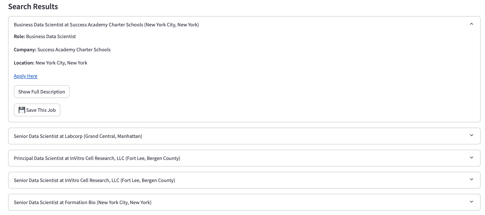
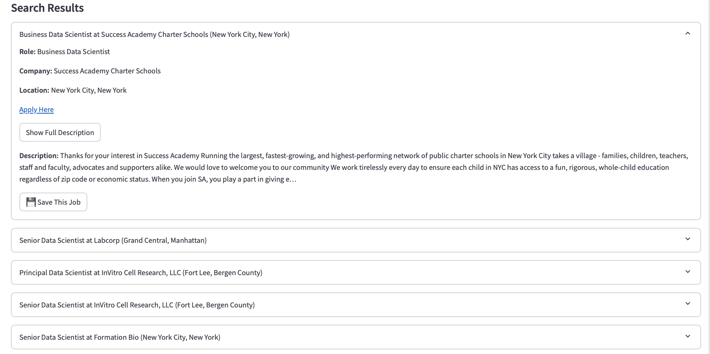
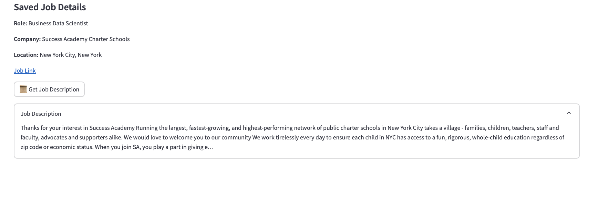
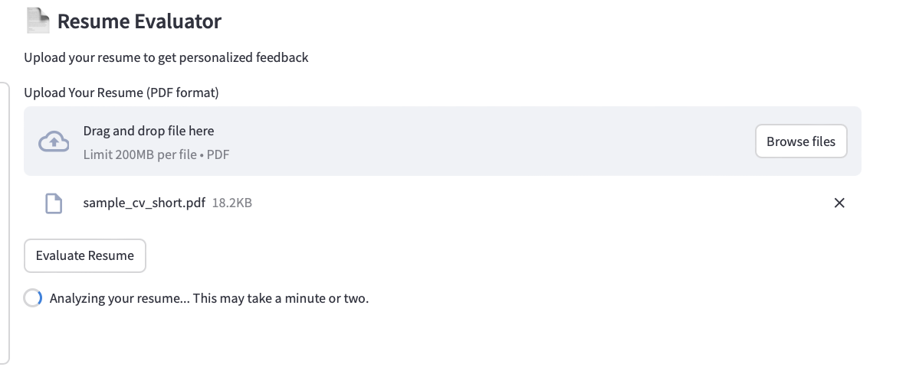
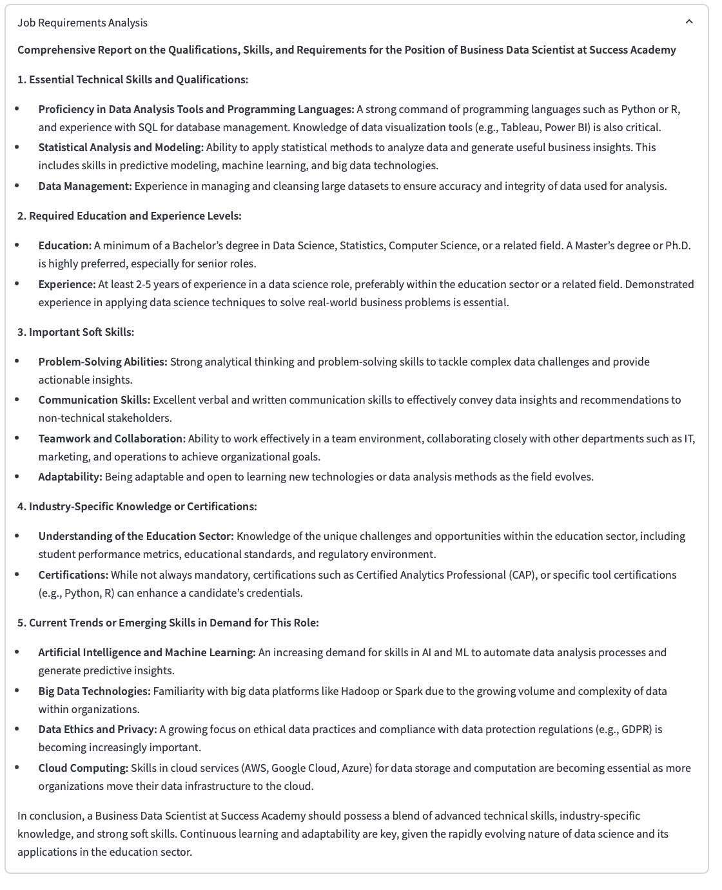
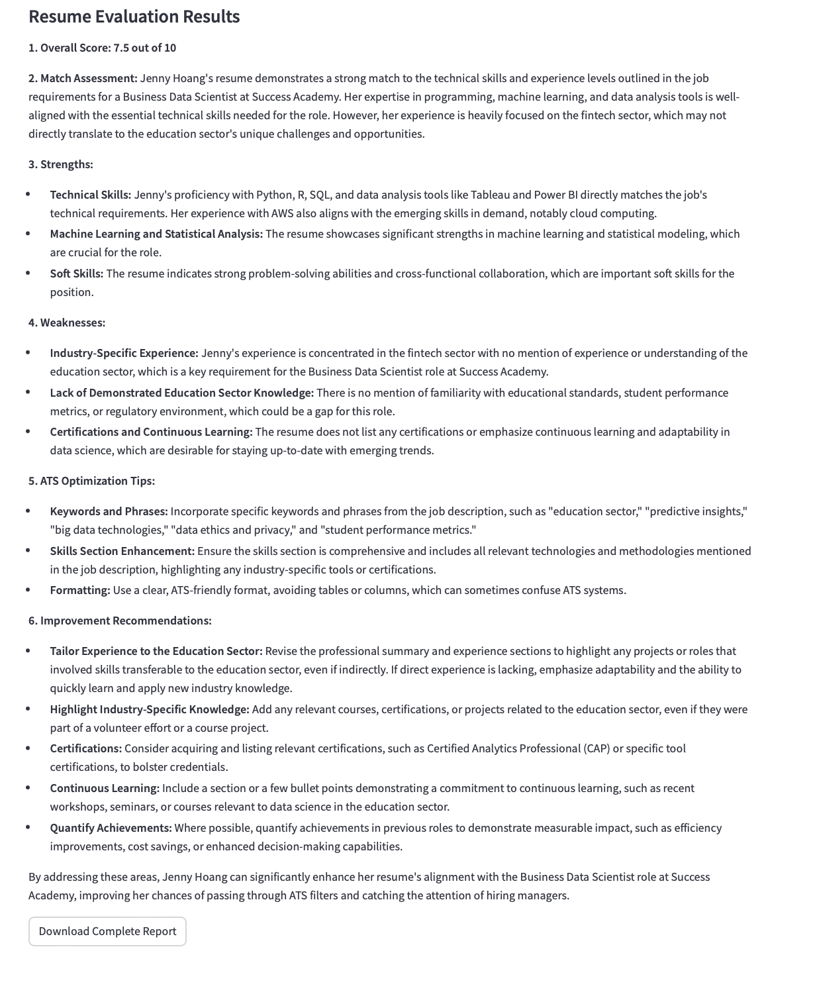

# AI-Powered Job Search Assistant

##  Final Assignment - Agentic System with CrewAI

This project is part of the final assignment for the **Agentic System developed by CrewAI**. The objective was to explore AI-driven technologies integrated with **GPT models** to solve real-world challenges. Our focus was on **enhancing job search efficiency** by leveraging AI to find relevant job opportunities,evaluate resumes and provide tailored CV improvement suggestions.

---

##  Project Overview
We developed an **AI-powered job search assistant** that optimizes job searches by:

- Finding relevant job opportunities.
- Evaluating resumes against job requirements.
- Offering personalized CV improvement tips.
  
The system provides a seamless and intelligent job application process, helping users navigate the competitive job market efficiently.

---
## User Interaction & Workflow

### **Step 1: User Inputs Resume & Job Preference**
The user interacts with the app  by entering their **job title, preferred location**, and the **number of job results** they wish to retrieve.

  

**The system returns job listings**

- Users can review job offers, read descriptions, and click on job links for more details.

  

  

### **Step 2: Save Preferred Job and Requests Description**
- The user selects the job offer they like the most.

  

### **Step 3: Upload Resume for Evaluation**
- The user uploads their resume in PDF format.
- The system processes the resume and saved job description and begins analyzing it.

  

- The system generates a **comprehensive job requirements analysis** for the selected position.
- This includes required **technical skills, education, experience levels, soft skills, and industry-specific knowledge**.
  

  

### **Step 4: Resume Evaluation Results**
- The system evaluates the user's resume and assigns an **overall score** based on job fit.
- A **match assessment** highlights how well the resume aligns with the job description.
- **Strengths and weaknesses** are identified, focusing on technical skills, industry experience, and certifications.
- **ATS Optimization Tips** suggest improvements in formatting, keywords, and skill section enhancements.
- **Personalized improvement recommendations** help the user tailor their resume for better alignment with the desired job role.
- The user can download a complete report with detailed insights for further optimization.

  

---

## **Conclusion**

This project enhances the job search process by integrating AI-powered job search tools, advanced resume analysis, and comprehensive market insights. It enables users to efficiently identify relevant career opportunities, gain a deeper understanding of job expectations, and refine their resumes to increase their competitiveness in the job market

## **Contributors**

Karolina Motyka

Thi Minh Nguyen
