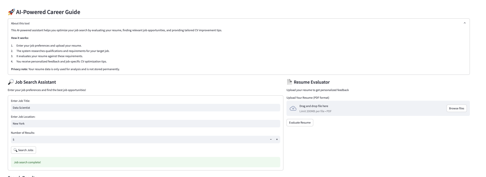

# AI-Powered Job Search Assistant

##  Final Assignment - Agentic System with CrewAI

This project is part of the final assignment for the **Agentic System developed by CrewAI**. The objective was to explore AI-driven technologies integrated with **GPT models** to solve real-world challenges. Our focus was on **enhancing job search efficiency** by leveraging AI to find relevant job opportunities,evaluate resumes and provide tailored CV improvement suggestions.

---

##  Project Overview
We developed an **AI-powered job search assistant** that optimizes job searches by:

- Finding relevant job opportunities.
- Evaluating resumes against job requirements.
- Offering personalized CV improvement tips.
  
The system provides a seamless and intelligent job application process, helping users navigate the competitive job market efficiently.

---
## User Interaction & Workflow

### **Step 1: User Inputs Resume & Job Preference**
The user interacts with the app  by entering their **job title, preferred location**, and the **number of job results** they wish to retrieve.
#### Example UI:

  

